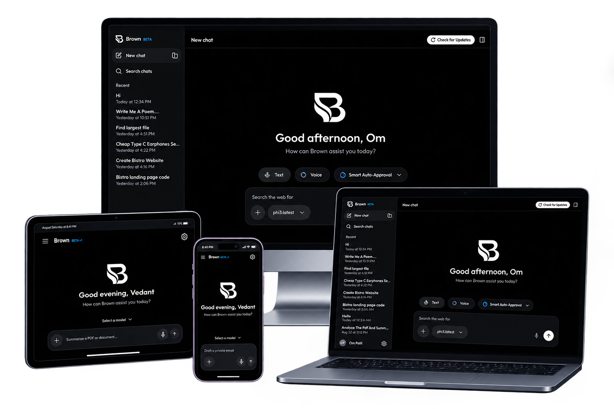

# Brown AI: Autonomous Hybrid AI Agent for Windows & Android

[](https://usebrown.online/)
[](https://github.com/vedantwankhade123/ultron-releases/releases)
[](https://github.com/vedantwankhade123/ultron-releases/releases)
[](LICENSE)

<p align="center">
  <a href="https://usebrown.online/">
    
  </a>
</p>

<p align="center">
  <strong><a href="https://usebrown.online/">usebrown.online</a></strong> — Official website with setup guides, docs, and direct downloads.
</p>

Brown AI is a premium, high-fidelity offline AI assistant built for Windows and Android. Utilizing local LLMs powered by Ollama alongside hybrid cloud intelligence (Gemini 3.5, Claude 3.7, DeepSeek R1, OpenAI), Brown serves as an autonomous interface agent capable of scanning configurations, executing system commands inside controlled sandbox parameters, and performing natural language operations—all while keeping your data entirely local and private.

---

## 💾 Downloads & Executables

Download pre-built ready-to-run Windows binaries directly from the official website or GitHub release:

🌐 **Official Website**: [usebrown.online](https://usebrown.online/)

<table width="100%">
  <thead>
    <tr>
      <th align="left" width="20%">Build Type</th>
      <th align="left" width="35%">File Name</th>
      <th align="left" width="45%">Description</th>
    </tr>
  </thead>
  <tbody>
    <tr>
      <td><b>Installer</b></td>
      <td><a href="https://github.com/vedantwankhade123/Ultron/releases/download/v1.0.14-beta.1/Ultron.AI.Setup.v1.0.14.exe"><code>Ultron.AI.Setup.v1.0.14.exe</code></a></td>
      <td>Standard Windows setup wizard with Start Menu and Desktop shortcuts.</td>
    </tr>
    <tr>
      <td><b>Portable</b></td>
      <td><a href="https://github.com/vedantwankhade123/Ultron/releases/download/v1.0.14-beta.1/Ultron.AI.v1.0.14.exe"><code>Ultron.AI.v1.0.14.exe</code></a></td>
      <td>Standalone executable. Runs immediately on Windows without installation.</td>
    </tr>
  </tbody>
</table>

> 🔗 Or view all assets on the [Official Releases Page](https://github.com/vedantwankhade123/Ultron/releases) (**Ultron BETA v1.0.0**).
> 
> 📸 Follow us on Instagram: [@ultron_offline](https://www.instagram.com/ultron_offline) | ✉️ Contact: `contact@usebrown.online`

---

## Key Features

- **Offline Kokoro TTS & Whisper STT:** Five local English voices plus on-device speech recognition—download models from Settings → Agent Sounds after install.
- **Gemini Cloud Voices:** Optional Google cloud text-to-speech when a Gemini API key is configured.
- **Slim Windows Installers:** Smaller setup/portable builds; heavy AI model files are fetched on the user's PC when needed.
- **Seamless Auto-Updates:** Integrates `electron-updater` with GitHub Releases. Checks for updates on launch and prompts to restart when a new build is available.
- **Local AI Recommendation Engine:** Profiles host hardware (CPU threads, RAM, GPU) on boot to recommend the optimal local quantized LLM footprint (e.g. `phi4`).
- **One-Click Ollama Installer:** Silent background winget orchestration that detects, downloads, and boots local Ollama binding instances on the fly.
- **Spotlight command Overlay:** A premium, blur-backdrop full-screen command search overlay (`width: 100vw; height: 100vh`) supporting debounced natural language indexing queries over historical chat memory.
- **Dynamic AI-Driven Session Summarizer:** Automatically analyzes incoming prompt requests to summarize conversations into a concise 2-3 word topic header inside sidebar list feeds in real-time.
- **Windows Start Menu Program Scan:** Scans user and system shortcut paths (`.lnk`) and automatically resolves their absolute `.exe` targets to fetch and render **real, colored program brand logos** (like Chrome, VS Code, Brave, AnyDesk, etc.) next to setting checkable options.
- **Draggable metrics Splitter:** Real-time mouse dragging dividers to resize middle chat frames and collapse system metrics panels completely if dragged below `120px` constraints.
- **Human-in-the-Loop Validation:** High-security adaptive authorization boundary dialogs requesting human verification prior to launching command subprocesses.
- **Autonomous Desktop Agent:** Multi-step task execution with live progress UI, app control, screen capture, Windows OCR fallback, and vision auto-routing (Gemini / llava).
- **Google Gemini Integration:** Live model discovery from your API key, connected-status badge, and cloud inference alongside local Ollama models.
- **Smarter App Matching:** Fuzzy name resolution, alias table, and clarifying suggestions when an app is not found.
- **Safety & Undo:** Apps allowlist enforcement by permission mode, sensitive-screen blocking, and rollback for file writes.

## Technical Architecture

Built on a secure **Electron + CommonJS Preload Sandbox** runtime:
- **Main Process:** Handles Windows API bindings, start menu directory indexes, winget package integrations, and secure subprocess execution streams.
- **Preload Hook Layer:** Safeguards DOM accesses by exposing isolated, context-bridged IPC handlers.
- **Renderer UI:** Written in standard HTML5, custom vanilla CSS (Gemini-esque dark theme accenting), and structured Javascript controllers.

## Prerequisites

- **OS:** Windows 10/11 (Local PowerShell & WinGet enabled).
- **Inference Runtime:** [Ollama](https://ollama.com/) (Automatically installable inside settings connectors).

## Building from Source

If you prefer building from source rather than downloading the pre-compiled `.exe` binaries:

1. Clone the repository:
   ```bash
   git clone https://github.com/vedantwankhade123/Ultron.git
   cd Ultron
   ```

2. Install node dependencies:
   ```bash
   npm install
   ```

3. Build Windows Executables:
   ```bash
   npm run build:win
   ```
   *The built installer and portable binaries will be generated inside the `dist/` folder.*

4. Launch the desktop application locally:
   ```bash
   npm start
   ```

---

## 📜 Release History & Changelog

All versions are available on the [GitHub Releases](https://github.com/vedantwankhade123/Ultron/releases) page.

| Version | Key Highlights & Changes | Direct Link |
| :--- | :--- | :--- |
| **`v1.0.13`** *(Latest)* | **Aug 15, 2026** — Robust setup wizard branding (sidebar/header), precise shortcut targeting, clean file replacement, eliminate drive root folder duplication | [View Release](https://github.com/vedantwankhade123/Ultron/releases/tag/v1.0.13) |
| **`v1.0.12`** | **Aug 14, 2026** — Audio visualizer stability, model selector dropdown polish, voice TTS volume controls | [View Release](https://github.com/vedantwankhade123/Ultron/releases/tag/v1.0.12) |
| **`v1.0.11`** | **Aug 13, 2026** — Local AI Agent orchestration improvements & Whisper STT speech recognition tuning | [View Release](https://github.com/vedantwankhade123/Ultron/releases/tag/v1.0.11) |
| **`v1.0.10`** | **Aug 12, 2026** — Native Windows audio player fallback and voice worker process isolation | [View Release](https://github.com/vedantwankhade123/Ultron/releases/tag/v1.0.10) |
| **`v1.0.9`** | **Aug 10, 2026** — Storage settings overhaul, custom directory browse & persistent data isolation | [View Release](https://github.com/vedantwankhade123/Ultron/releases/tag/v1.0.9) |
| **`v1.0.8`** | **Aug 8, 2026** — Model Context Protocol (MCP) server integration & Windows UI Automation tools | [View Release](https://github.com/vedantwankhade123/Ultron/releases/tag/v1.0.8) |
| **`v1.0.7-beta.8`** | **Aug 6, 2026** — Multi-modal screen capture agent, Windows OCR fallback & Gemini vision routing | [View Release](https://github.com/vedantwankhade123/Ultron/releases/tag/v1.0.7-beta.8) |
| **`v1.0.7-beta.7`** | **Aug 5, 2026** — System diagnostics dashboard, storage management & live metrics splitter | [View Release](https://github.com/vedantwankhade123/Ultron/releases/tag/v1.0.7-beta.7) |
| **`v1.0.7-beta.6`** | **Aug 3, 2026** — Fast app startup optimization and auto-updater background feed checks | [View Release](https://github.com/vedantwankhade123/Ultron/releases/tag/v1.0.7-beta.6) |
| **`v1.0.7-beta.5`** | **Aug 1, 2026** — Ollama Cloud account sync, Kokoro TTS download fixes & chat deletion controls | [View Release](https://github.com/vedantwankhade123/Ultron/releases/tag/v1.0.7-beta.5) |
| **`v1.0.6`** | **Jul 28, 2026** — Slim installer architecture — on-demand AI model downloads for fast setup | [View Release](https://github.com/vedantwankhade123/Ultron/releases/tag/v1.0.6) |
| **`v1.0.5`** | **Jul 24, 2026** — Local hardware profiler (CPU/GPU/RAM) and automated LLM recommendation | [View Release](https://github.com/vedantwankhade123/Ultron/releases/tag/v1.0.5) |
| **`v1.0.4`** | **Jul 20, 2026** — Seamless auto-update background polling and safe GitHub releases fallback | [View Release](https://github.com/vedantwankhade123/Ultron/releases/tag/v1.0.4) |
| **`v1.0.3`** | **Jul 16, 2026** — Custom installation directory data routing and sandboxed memory persistence | [View Release](https://github.com/vedantwankhade123/Ultron/releases/tag/v1.0.3) |
| **`v1.0.2`** | **Jul 12, 2026** — Official website integration, landing documentation and direct asset mirrors | [View Release](https://github.com/vedantwankhade123/Ultron/releases/tag/v1.0.2) |
| **`v1.0.1`** | **Jul 8, 2026** — Full-width responsive download mirrors & dark glassmorphic styling polish | [View Release](https://github.com/vedantwankhade123/Ultron/releases/tag/v1.0.1) |
| **`v1.0.0`** | **Jul 1, 2026** — 🎉 Initial public release: Offline Ollama LLMs, voice waveform UI & system tools | [View Release](https://github.com/vedantwankhade123/Ultron/releases/tag/v1.0.0) |

---

## 📄 License & Intellectual Property
 
Ultron and its associated codebases, architectures, and desktop/mobile applications are **Proprietary & Confidential Software**. All Rights Reserved.

- See the full [LICENSE](LICENSE) file for proprietary terms and conditions.
- Copyright (c) 2026 Vedant Wankhade. Unauthorized copying, distribution, or decompilation is strictly prohibited.
