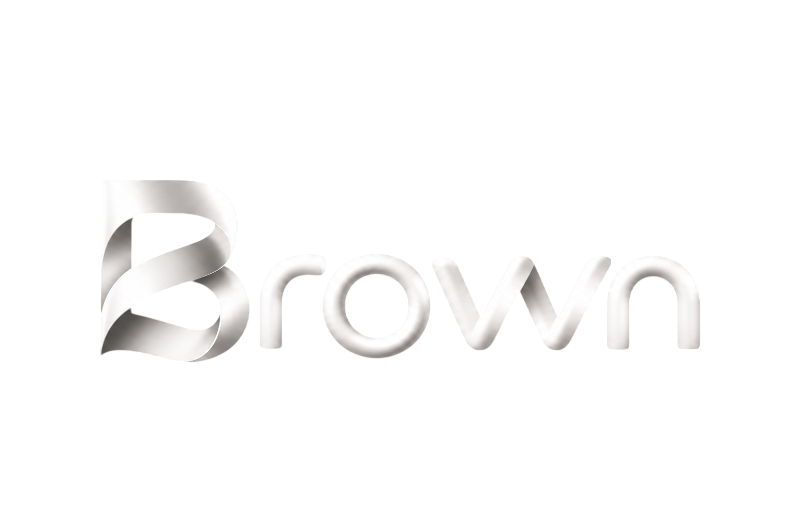

# Brown AI: Autonomous Local-First AI Ecosystem

[](https://usebrown.online/)
[](https://github.com/vedantwankhade123/ultron-releases/releases)
[](https://github.com/vedantwankhade123/ultron-releases/releases)
[](LICENSE)

<p align="center">
  <a href="https://usebrown.online/">
    
  </a>
</p>

<p align="center">
  <strong><a href="https://usebrown.online/">usebrown.online</a></strong> — Official website with setup guides, docs, and direct downloads.
</p>

**Brown AI** is a production-grade, local-first, privacy-focused autonomous AI assistant ecosystem spanning **Windows Desktop**, **Mobile (Android/iOS)**, and **Web**. Combining local on-device quantized LLMs (via Ollama, GGUF, and Hugging Face) with hybrid cloud intelligence (Gemini 2.5/3, Claude 3.7, DeepSeek R1, OpenAI), Brown provides an autonomous desktop interface agent capable of workflow execution, system orchestration, local voice synthesis, and cross-device synchronization without compromising data privacy.

---

## 🏛️ Ecosystem & Monorepo Architecture

This monorepo houses all core projects and shared services:

```
d:/Ultron/
├── src/                          # 🖥️ Project 1: Windows Desktop Electron Application
├── mobile/                       # 📱 Project 2: Mobile Application (React Native / Expo)
├── Ultron Website/               # 🌐 Project 3: Official Web Portal (React / Vite / Firebase)
├── python/                       # 🐍 Local Python Microservice (Inference & Scraping)
├── Assets/                       # 🎨 Shared Brand Assets, Logos, Sounds & Installer Graphics
├── docs/                         # 📚 Central Documentation Library
│   ├── architecture/             # System Architecture & Technical Specifications
│   ├── guides/                   # Operational, Distribution & Store Setup Guides
│   ├── product/                  # PRD, Roadmap & Backlog
│   ├── releases/                 # Release Notes & Changelogs
│   ├── research/                 # Academic Papers & Evaluation Logs
│   └── enhancements/             # Performance, Latency & Fix Guides
├── scripts/                      # 🛠️ Build, Voice, and Maintenance Automation Scripts
└── tests/                        # 🧪 Desktop Automated Test Suite
```

---

## 🚀 Projects Quick Start

### 1. 🖥️ Windows Desktop Application (`src/`)
Built with Electron, CommonJS Preload Sandbox, and a local agent orchestration engine.

```bash
# Install dependencies
npm install

# Run automated tests
npm test

# Launch in development mode
npm start

# Build Windows NSIS Installer & Portable Executable
npm run build:win
```

### 2. 📱 Mobile Application (`mobile/`)
Built with React Native, Expo, SQLite local storage, and on-device GGUF inference connectors.

```bash
cd mobile

# Install mobile dependencies
npm install

# Run mobile test verification suite
node tests/verify-mobile-suite.js

# Start Expo development server
npx expo start
```

### 3. 🌐 Official Web Portal (`Ultron Website/`)
Built with React, Vite, and Firebase hosting/cloud services.

```bash
cd "Ultron Website"

# Install web dependencies
npm install

# Start local Vite development server
npm run dev

# Build production bundle
npm run build
```

### 4. 🐍 Python AI Microservice (`python/`)
Local FastAPI loopback service (`127.0.0.1:8000`) for custom inference pipelines.

```bash
cd python
pip install -r requirements.txt
python server.py
```

---

## 💾 Downloads & Binaries

Pre-compiled Windows binaries are available directly from the official website and GitHub Releases:

<table width="100%">
  <thead>
    <tr>
      <th align="left" width="20%">Build Type</th>
      <th align="left" width="35%">File Name</th>
      <th align="left" width="45%">Description</th>
    </tr>
  </thead>
  <tbody>
    <tr>
      <td><b>Installer</b></td>
      <td><a href="https://github.com/vedantwankhade123/ultron-releases/releases/download/v1.0.14/Ultron.AI.Setup.v1.0.14.exe"><code>Ultron.AI.Setup.v1.0.14.exe</code></a></td>
      <td>Standard Windows setup wizard with Start Menu and Desktop shortcuts.</td>
    </tr>
    <tr>
      <td><b>Portable</b></td>
      <td><a href="https://github.com/vedantwankhade123/ultron-releases/releases/download/v1.0.14/Ultron.AI.v1.0.14.exe"><code>Ultron.AI.v1.0.14.exe</code></a></td>
      <td>Standalone executable. Runs immediately on Windows without installation.</td>
    </tr>
  </tbody>
</table>

---

## 📚 Central Documentation

For comprehensive technical guides and specifications, browse the **[Documentation Hub](docs/README.md)**:

- **[System Architecture](docs/architecture/SYSTEM_ARCHITECTURE.md)**: Multi-process topology, security sandbox, and model connectors.
- **[Technical Specifications](docs/architecture/DOCUMENTATION.md)**: Full IPC protocol, Kokoro TTS, Whisper STT, and sync specifications.
- **[Windows Distribution Guide](docs/guides/WINDOWS_DISTRIBUTION_GUIDE.md)**: Packaging, NSIS installers, and portable binaries.
- **[Microsoft Store Guide](docs/guides/MICROSOFT_STORE_GUIDE.md)**: MSIX/APPX packaging and Windows Store release process.
- **[Roadmap & PRD](docs/product/ROADMAP_AND_PRD.md)**: Strategic product roadmap and requirements.
- **[Research Paper](docs/research/RESEARCH_PAPER.md)**: Formal research paper on local agentic reasoning and on-device privacy.
- **[Release Notes](docs/releases/RELEASE_NOTES.md)**: Complete changelog across all versions.

---

## 🧪 Testing & Quality Assurance

- **Desktop Test Suite**: Run `npm test` from root (covers Security Orchestration, Agent Loop, Multi-Provider Hub, Autonomy Upgrade, and RAG Engine).
- **Mobile Test Suite**: Run `node mobile/tests/verify-mobile-suite.js` (covers Model Catalog, GGUF Quantization, Chat Repositories, Wi-Fi Companion Pairing, and SecureStore).

---

## 📄 License & Intellectual Property

Ultron and its associated codebases, architectures, and desktop/mobile applications are **Proprietary & Confidential Software**. All Rights Reserved.

- See the full [LICENSE](LICENSE) file for proprietary terms and conditions.
- Copyright (c) 2026 Vedant Wankhade. Unauthorized copying, distribution, or decompilation is strictly prohibited.
