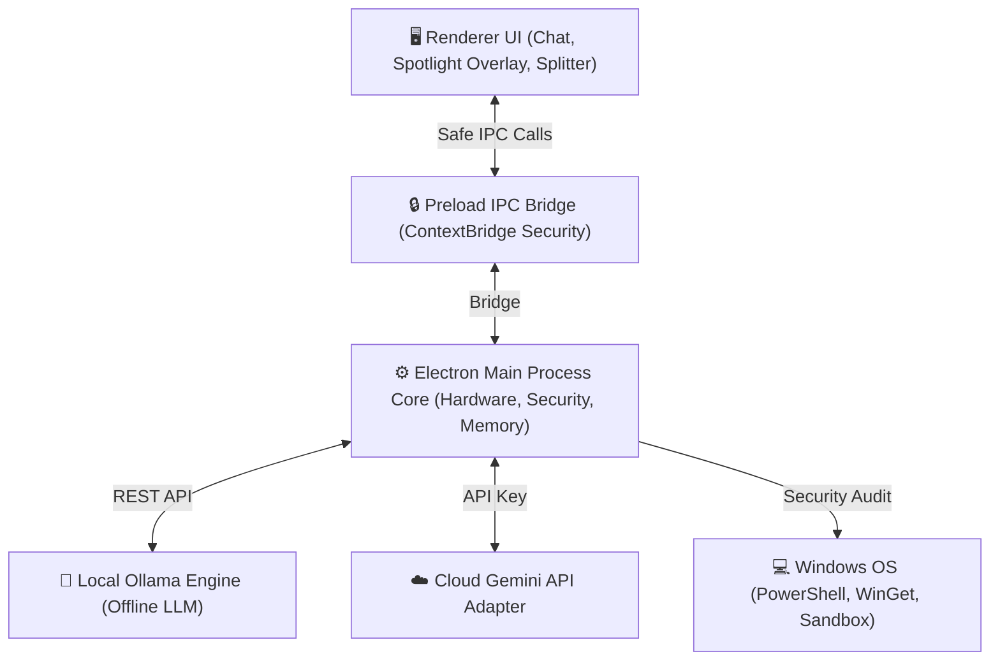
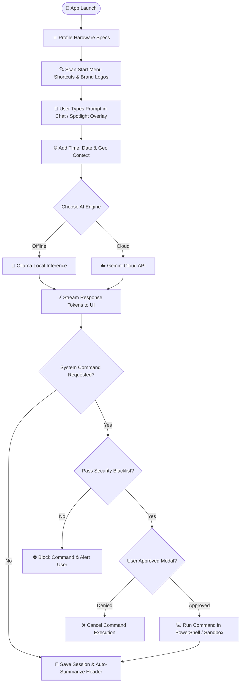

# Synopsis & System Architecture Specification

**Project Title:** An Autonomous AI Agent for Operating Systems (Ultron)  
**Institution:** G H Raisoni University, Amravati — School of Engineering & Technology  
**Department:** Computer Science & Engineering  
**Academic Session:** 2026–27  
**Base Research Paper Reference:** *Large Language Model-Based Autonomous Agents* (Prerak Garg & Divya Beeram, IJCTT, Vol. 72, Issue 5, May 2024)

---

## 1. Title of the Project

**An Autonomous AI Agent for Operating Systems** (Project Codename: *Ultron*)  

---

## 2. Abstract

Ultron is an advanced, high-fidelity offline AI desktop assistant designed specifically for the Microsoft Windows environment. Built on an isolated **Electron + CommonJS Preload Sandbox** architecture, Ultron integrates local quantized Large Language Models (LLMs) via Ollama and optional cloud services (such as Google Gemini APIs) directly into native Windows system APIs. The system features dynamic hardware profiling to match local models (such as `phi4` or `llama3.2`) to host RAM and GPU constraints, a global Spotlight Command Overlay (`Ctrl+K`), an automated Start Menu shortcut parser with brand icon resolution, and an asynchronous chat session summarizer. To prevent unauthorized actions, Ultron incorporates a **Human-in-the-Loop (HITL) security validation boundary** that prompts user verification before executing shell subprocesses. By operating locally, Ultron delivers 100% data privacy, zero API operational costs, and sub-second execution latency, setting a benchmark for privacy-preserving desktop autonomous agents.

---

## 3. Introduction

### 3.1 Background of the Problem
The rapid rise of Large Language Models (LLMs) has transformed software engineering and digital productivity. However, relying on cloud-centric AI services introduces significant data privacy risks, high subscription costs, network latency dependencies, and a lack of direct integration with local operating system environments. Corporate developers and privacy-conscious users require autonomous AI assistants that can operate entirely on local hardware without sending sensitive code or system data to third-party cloud servers.

### 3.2 Motivation for Choosing the Topic
Recent research by Garg & Beeram (2024) demonstrates that LLM-based autonomous agents significantly improve developer productivity—reducing debugging time by 50% and conflict resolution efforts by 75%. Combining these agentic capabilities with local, offline LLMs (via Ollama) and native Windows desktop integration provides a secure, cost-free, and privacy-first solution.

### 3.3 Scope and Significance
Ultron bridges the gap between high-level natural language reasoning and local Windows operating system control. Its scope encompasses hardware-aware model allocation, context-isolated IPC communication, real-time start menu shortcut scanning, and secure command execution bounded by human authorization.

### 3.4 Real-Life Applications
- **Offline Code & Document Analysis:** Perform confidential code reviews and data processing without cloud data transmission.
- **Desktop Task Automation:** Execute shell scripts, launch indexed Windows programs with brand icons, and perform system configuration scans.
- **Privacy-Preserving AI Workspace:** Serve as an intelligent, always-available desktop assistant with zero token costs.

---

## 4. Objectives of the Project

1. **Local & Offline Execution:** Enable 100% private, offline LLM inference using Ollama on local hardware.
2. **Hardware-Aware Model Allocation:** Profile host CPU, RAM, and GPU specs on boot to automatically allocate optimal model footprints (e.g., `phi4`, `llama3.2`).
3. **Human-in-the-Loop Security Boundary:** Enforce strict permission dialogs before executing any terminal or shell subprocess.
4. **Seamless Windows System Integration:** Scan Windows Start Menu shortcuts (`.lnk`), resolve `.exe` targets, and display authentic brand logos.
5. **Enhanced UI/UX:** Provide a fluid Gemini-esque dark UI with a full-screen **Spotlight Overlay (`Ctrl+K`)** and a **Draggable Splitter** for dynamic metrics panel resizing.
6. **Dynamic Session Summarization:** Automatically generate 2–3 word topic headers for chat sessions in real-time.
7. **Hybrid Cloud Option:** Support optional Google Gemini API connectors for complex multi-modal tasks when online.

---

## 5. Problem Statement

Current commercial AI tools depend heavily on external cloud servers, exposing proprietary source code and sensitive user data to security vulnerabilities and data leaks. Furthermore, existing autonomous agents often lack operating system-level security controls, creating risks of unverified, destructive command execution on local machines. **Ultron** addresses these critical challenges by providing an offline-first Windows autonomous agent that combines local LLM inference with strict human-in-the-loop security validation, ensuring complete privacy, zero API costs, and controlled OS automation.

---

## 6. Literature Review & Existing System Analysis

### 6.1 Insights from Base Paper (*Garg & Beeram, 2024*)
The foundational paper *"Large Language Model-Based Autonomous Agents"* (IJCTT, May 2024) outlines the core architectural components required for autonomous AI agents:
1. **Profiling Module:** Defines agent roles, capabilities, and system rules.
2. **Memory Module:** Manages short-term contextual windows and long-term structured/embedding storage.
3. **Planning Module:** Decomposes complex goals into manageable sub-tasks using multi-path reasoning.
4. **Action Module:** Translates AI decisions into concrete actions via external tools and APIs.

The paper highlights that integrating AI agents into developer workflows yields a **50% reduction in debugging time**, a **75% reduction in version control conflicts**, and a **35% improvement in coding standard adherence**.

### 6.2 Comparison with Existing Systems

| Feature / Dimension | Existing Cloud AI (e.g., ChatGPT, Claude) | Standard Agent Frameworks (e.g., AutoGPT, CrewAI) | **Ultron (Proposed System)** |
| :--- | :--- | :--- | :--- |
| **Data Privacy** | Low (Data sent to third-party cloud) | Variable (Depends on backend model) | **100% Private (Local Offline Inference)** |
| **Operating System Integration**| None (Web browser / API wrapper) | Limited (CLI scripts) | **Native Windows (Start Menu, Shell, Sandbox)** |
| **Hardware Profiling** | None | None | **Dynamic (Profiles CPU/RAM/GPU on boot)** |
| **Command Security** | N/A | High risk of unverified execution | **Human-in-the-Loop Validation Boundary** |
| **Operational Cost** | High (Monthly subscriptions / API tokens)| Token-dependent | **Zero Token Cost (Free Local Ollama Engine)** |

---

## 7. Proposed System & Architecture

Ultron adopts the agentic architecture proposed by Garg & Beeram (2024)—incorporating Profiling, Memory, Planning, and Action modules—implemented within a secure Electron desktop shell.

### 7.1 Simple Visual System Architecture Diagram

```
+---------------------------------------------------------------------------------+
|                         ULTRON DESKTOP SYSTEM ARCHITECTURE                      |
+---------------------------------------------------------------------------------+
                                      |
         +----------------------------+----------------------------+
         |                                                         |
         v                                                         v
+-------------------------------+                       +-------------------------+
|         RENDERER UI           |                       |   PRELOAD IPC BRIDGE    |
| - Main Chat View & Sidebar    | <===================> | - ContextBridge API     |
| - Spotlight Overlay (Ctrl+K)  |                       | - Isolated IPC Channels |
| - Draggable Metrics Splitter  |                       +-------------------------+
| - Human-in-the-Loop Modal     |                                    |
+-------------------------------+                                    v
                                                        +-------------------------+
                                                        |   ELECTRON MAIN CORE    |
                                                        | - App Lifecycle         |
                                                        | - Hardware Profiler     |
                                                        | - Security Engine       |
                                                        | - Session Memory        |
                                                        | - Start Menu Scanner    |
                                                        +-------------------------+
                                                                     |
         +------------------------------+----------------------------+
         |                              |                            |
         v                              v                            v
+------------------+          +------------------+          +-------------------+
|   LOCAL OLLAMA   |          |    GEMINI API    |          |  WINDOWS SYSTEM   |
| Offline AI Model |          | Cloud AI Option  |          | PowerShell / Shell|
| (localhost:11434)|          |                  |          | & Windows Sandbox |
+------------------+          +------------------+          +-------------------+
```

### 7.2 Interactive Architecture Flowchart



---

## 8. Methodology & Workflow Breakdown

The system executes through four main operational phases:

```
===================================================================================
PHASE 1: APP STARTUP & HARDWARE PROFILING
===================================================================================
[ Launch App ] ---> [ Profile CPU / RAM / GPU ] ---> [ Recommend Local AI Model (e.g. phi4) ]

===================================================================================
PHASE 2: PROMPT ENRICHMENT & ROUTING
===================================================================================
[ User Input ] ---> [ Inject Time & Geo Context ] ---> [ Route to Selected Engine ]

===================================================================================
PHASE 3: INFERENCE & TOKEN STREAMING
===================================================================================
                    +---> [ LOCAL MODE  : Run Ollama Offline Engine ] ---+
                    |                                                     |
[ Inference ] ------+                                                     +---> [ Stream Answer ]
                    |                                                     |
                    +---> [ CLOUD MODE  : Run Gemini API ] --------------+

===================================================================================
PHASE 4: COMMAND SECURITY & HUMAN-IN-THE-LOOP CHECK
===================================================================================
[ Does Response Contain System Command Execution? ]
         |
         +---> NO  ---> [ Save Chat & Auto-Summarize Topic Header ]
         |
         +---> YES ---> [ Validate Command Blacklist & Target Paths ]
                             |
                             +---> UNSAFE ---> [ Block Command & Show Security Alert ]
                             |
                             +---> SAFE   ---> [ Prompt User Approval (Modal Dialog) ]
                                                     |
                                                     +---> Denied   ---> [ Cancel Command ]
                                                     +---> Approved ---> [ Run in PowerShell / Sandbox ]
```

### 8.1 Master Workflow Sequence Diagram



---

## 9. Modules Description

Ultron is structured into seven core modules:

1. **Renderer UI Module (`src/renderer/`):**
   - Renders the primary chat interface, sidebar history, and Gemini-style dark accent layout.
   - Houses the full-screen **Spotlight Command Overlay (`Ctrl+K`)** for rapid searching.
   - Includes a **Draggable Splitter** for dynamic middle panel resizing and collapsible metrics display.

2. **Preload Context Isolation Module (`src/preload/preload.js`):**
   - Enforces Electron security best practices (`contextIsolation: true`, `nodeIntegration: false`).
   - Safely bridges IPC commands (`window.electronAPI`) without exposing Node.js primitives to the DOM.

3. **Electron Main Core Module (`src/main/index.js` & `ipc.js`):**
   - Manages application lifecycle, window management, and configuration paths (`%APPDATA%/LocalAgent`).
   - Acts as the central IPC router between the UI and system runtimes.

4. **Hardware Profiling & Allocator Module (`src/main/hardware.js`):**
   - Profiles CPU logical cores, total system RAM, and GPU adapters on boot.
   - Automatically recommends suitable quantized model footprints based on available hardware resources.

5. **Security Engine & Sandbox Module (`src/main/security.js` & `sandbox.js`):**
   - Enforces path verification, command blacklists, and security modes (`Strict`, `Adaptive`, `Unrestricted`).
   - Manages **Human-in-the-Loop (HITL)** permission promises and triggers Windows Sandbox containers for isolated execution.

6. **Start Menu Program & Brand Logo Scanner Module (`src/main/ipc.js`):**
   - Scans system and user Start Menu shortcut directories (`.lnk` files).
   - Resolves target `.exe` binaries and extracts authentic brand icons for display in settings and search.

7. **Session Storage & Auto-Summarizer Module (`memory/conversations.json`):**
   - Persists chat threads locally in structured JSON format.
   - Executes background LLM prompts to generate concise 2–3 word topic titles for sidebar updating.

---

## 10. Hardware & Software Requirements

### 10.1 Hardware Requirements Matrix

| Requirement | Minimum Specs (Basic 3B–7B Local Models e.g. `llama3.2:3b`, `phi3:mini`) | Recommended Specs (Standard 7B–14B Local Models e.g. `phi4`, `qwen2.5:7b`) | High-Performance (14B–32B+ Models or Heavy Vision Models) |
| :--- | :--- | :--- | :--- |
| **CPU** | Quad-Core x64 Intel / AMD | 8+ Core x64 Processor (Intel i7/i9, AMD Ryzen 7/9) | 12+ Core High-Performance x64 Processor |
| **System RAM** | 8 GB RAM | 16 GB – 32 GB RAM | 32 GB – 64 GB RAM |
| **VRAM / GPU** | Integrated Graphics (Intel Iris Xe / AMD Radeon) | 6 GB – 8 GB Dedicated VRAM (NVIDIA RTX 3060/4060+) | 12 GB+ Dedicated VRAM (NVIDIA RTX 3080/4080/4090) |
| **Storage** | 10 GB Free SSD Storage | 30 GB Free NVMe SSD Storage | 50 GB+ Free NVMe SSD Storage |
| **Operating System**| Windows 10/11 64-bit | Windows 10/11 64-bit (PowerShell + WinGet enabled) | Windows 11 64-bit |

*Note: When using the Cloud Gemini API option, hardware requirements drop to 4 GB RAM and any dual-core processor with an active internet connection.*

---

## 11. Expected Outcomes & Impact

- **100% Data Privacy:** Confidential code, documents, and prompts remain entirely on the local machine.
- **Zero Token Cost:** Free local LLM execution via Ollama eliminates recurring monthly subscription fees.
- **Proven Productivity Gains:** Empowers developers with up to **50% faster debugging**, **75% fewer version conflicts**, and **35% higher code standard compliance** (aligned with Garg & Beeram, 2024).
- **Safe OS Automation:** Human-in-the-loop authorization prevents destructive command execution.

---

## 12. Future Scope

1. **Local Multi-Modal Vision:** Support local vision models (e.g. `llama3.2-vision`) for processing screenshots and UI diagrams.
2. **Autonomous Multi-Step Agents:** Extend HITL workflows to autonomous multi-step file and workspace management.
3. **Encrypted Local Vector Memory:** Integrate local vector databases (e.g., SQLite-vec or LanceDB) for semantic search across local documents.
4. **Cross-Platform Support:** Expand Start Menu scanning and OS shell bindings to macOS and Linux desktop environments.
