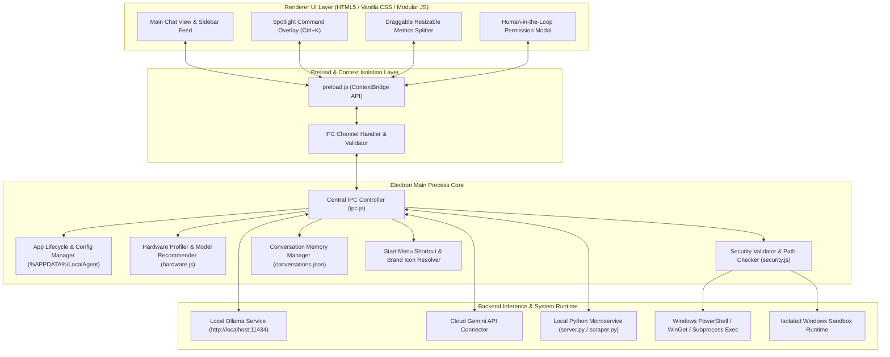
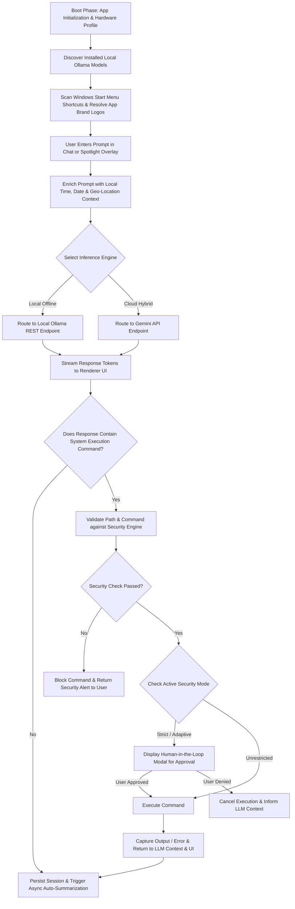
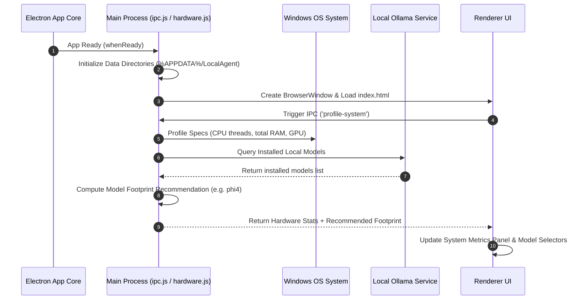
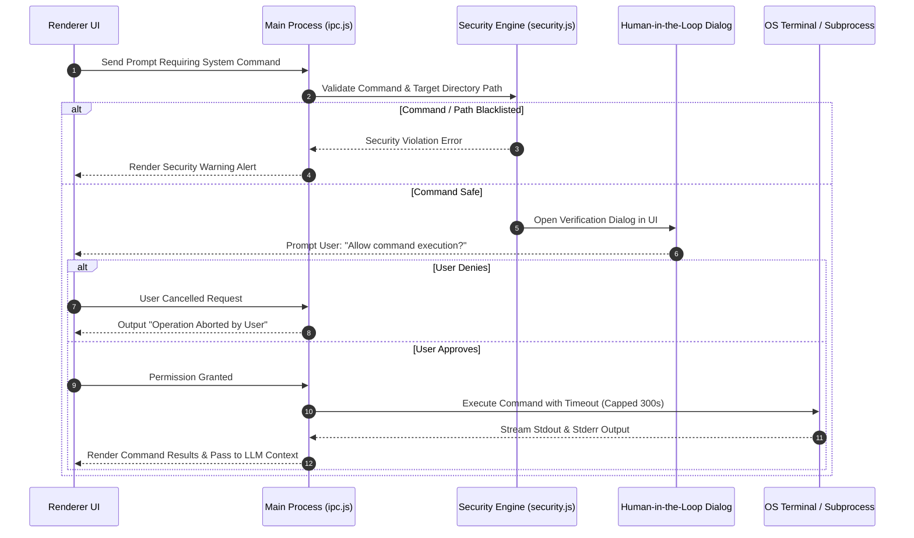
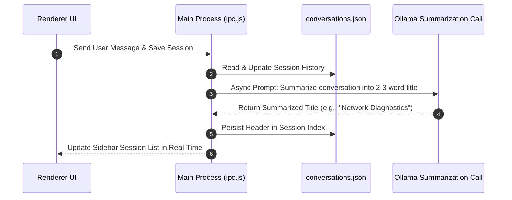

# System Architecture & Technical Specification: Ultron

Ultron is a high-fidelity, offline-first AI desktop assistant engineered specifically for Microsoft Windows. Built on an isolated **Electron + CommonJS Preload Sandbox** architecture, Ultron bridges local quantized Large Language Models (LLMs) via Ollama and optional cloud services (such as Google Gemini APIs) directly into native Windows APIs and system capabilities—all while maintaining privacy and data sovereignty.

---

## 1. System Architecture & Diagrams

Ultron employs a multi-tiered, decoupled architecture that separates presentation logic, main process control, security sandboxing, local LLM execution, and microservice capabilities.

### 1.1 System Architecture Topology Diagram

---

### 1.2 Process Isolation & Security Boundary Diagram

```mermaid
graph LR
    subgraph DOM ["Unprivileged Renderer (DOM)"]
        HTML["index.html"]
        CSS["index.css"]
        JS["renderer.js"]
    end

    subgraph Sandbox ["Isolation Boundary (ContextBridge)"]
        API["window.electronAPI"]
    end

    subgraph Main ["Privileged Node.js Main Process"]
        IPC["ipcMain Handlers"]
        FS["File System Access"]
        EXEC["Child Process Spawner"]
    end

    subgraph OS ["Windows Operating System"]
        PS["PowerShell / CMD"]
        WSB["Windows Sandbox Container"]
    end

    DOM -- "No Direct Node APIs" --> Sandbox
    Sandbox -- "Serialized IPC Channels" --> Main
    Main -- "Path & Command Security Audit" --> OS
```

---

### 1.3 Component Architecture Breakdown

1. **Renderer Layer (`src/renderer/`):**
   - Implemented using HTML5, modern vanilla CSS with dark theme accents, and asynchronous JavaScript controllers.
   - Includes a full-screen **Spotlight Command Overlay (`Ctrl+K`)** for quick indexing and natural language command input.
   - Features a **Draggable Splitter** for dynamic middle chat panel resizing and collapsible system metrics monitoring.

2. **Preload Hook Layer (`src/preload/preload.js`):**
   - Enforces context isolation (`contextIsolation: true`, `nodeIntegration: false`).
   - Exposes safe, selective IPC channels via `window.electronAPI` to shield renderer scripts from direct Node.js API access.

3. **Electron Main Process (`src/main/`):**
   - **`index.js`:** Coordinates app initialization, configuration folder creation (`%APPDATA%/LocalAgent`), and BrowserWindow lifecycle.
   - **`ipc.js`:** Serves as the primary message broker between UI components and OS/LLM execution services.
   - **`hardware.js`:** Profiles system CPU threads, system RAM, and active GPU adapters to recommend an optimal LLM model.
   - **`security.js` & `sandbox.js`:** Implements path validation, command blacklists, security mode toggles (Strict, Adaptive, Unrestricted), and optional Windows Sandbox execution.

4. **Inference & Backend Runtime (`python/`, Ollama REST):**
   - **Ollama Engine:** Runs locally on `http://localhost:11434` for 100% offline inference.
   - **Gemini API Adapter:** Provides optional cloud fallback/enhancement for multi-modal or ultra-complex reasoning tasks.
   - **Python Microservice (`server.py`):** Provides specialized web scraping (`scraper.py`) and custom Python ML inference execution (`inference.py`).

---

## 2. Proposed & Operational Methodology

The system operates via a continuous, asynchronous feedback loop comprising system discovery, prompt enrichment, local/cloud routing, security verification, and output streaming.

### 2.1 Master Operational Methodology Flowchart

---

### 2.2 Application Boot & Hardware Profiling Sequence Diagram

---

### 2.3 Command Security & Human-in-the-Loop Execution Sequence Diagram

---

### 2.4 Chat Session Management & Dynamic Auto-Summarization Sequence Diagram

---

### 2.5 Detailed Operational Methodology Steps

1. **System Profiling & Hardware Allocation:**
   - On boot, system hardware specifications are profiled (CPU thread count, total memory in GB, active display adapter).
   - An allocation engine maps hardware specs to recommended model footprints (e.g., allocation of `phi4` or `llama3.2` based on available RAM/VRAM).
2. **Start Menu Shortcut Resolution:**
   - Ultron scans user and system Start Menu shortcut directories (`.lnk` files).
   - Resolves underlying binary targets (`.exe`) and extracts brand colors and icons to provide an interactive program index.
3. **Context Enrichment & Prompt Pre-Processing:**
   - Incoming user requests are enriched with temporal metadata (ISO timestamp, week number, day of year) and location context.
4. **Human-In-The-Loop Security Verification:**
   - Shell command execution prompts trigger the security module (`security.js`).
   - If the active security policy requires user validation, an interactive authorization dialog pauses execution until explicitly confirmed by the user.
5. **Real-Time Session Auto-Summarization:**
   - After prompt completion, an asynchronous request invokes the LLM to generate a concise 2–3 word topic summary for updating sidebar feeds.

---

## 3. Technology Stack

| Layer / Subsystem | Technology | Purpose |
| :--- | :--- | :--- |
| **Desktop Shell** | Electron.js (v34+) | Native Windows desktop windowing, OS integration, lifecycle management. |
| **Runtime Environment** | Node.js (v20+) | Main process execution, file system access, process spawning. |
| **Frontend UI** | HTML5, Vanilla CSS, JS | Gemini-themed dark interface, Spotlight overlay, dynamic resizable layout. |
| **Preload Security** | Electron ContextBridge | Context-isolated IPC interface (`window.electronAPI`). |
| **Markdown Parser** | `marked.cjs` | Client-side rendering of rich markdown formatting and code blocks. |
| **Local LLM Engine** | Ollama REST API | Offline local LLM inference execution (`http://localhost:11434`). |
| **Cloud LLM API** | Google Gemini API | Cloud multi-modal & high-capacity inference option. |
| **Microservice Backend**| Python 3.10+, FastAPI / Flask | Local web scraping (`scraper.py`), Python script execution. |
| **System Orchestration**| PowerShell, WinGet CLI | Automatic dependency installation, desktop program scanning. |
| **Sandbox Environment**| Windows Sandbox CLI | Isolated containerized execution for untrusted scripts. |

---

## 4. Key Features & Capabilities

- **Hardware-Aware Model Recommendation Engine:** Automatically measures RAM and GPU capabilities on boot to recommend appropriate quantized models.
- **One-Click Winget Ollama Installer:** Silent background installation and service startup for local Ollama runtimes via Windows WinGet.
- **Spotlight Command Overlay (`Ctrl+K`):** Global full-screen search and command bar supporting instant historical chat queries.
- **Draggable Metrics Splitter:** Dynamic, resizable chat panels with collapsible system performance monitoring.
- **Human-in-the-Loop Security Boundary:** Interactive validation dialogs requiring explicit user authorization before running terminal commands.
- **Windows Start Menu Program Scan:** Indexing of system `.lnk` shortcuts with automatic extraction of colored brand logos.
- **Real-Time Session Summarization:** Automatic conversion of long chat threads into 2-3 word topic headers in sidebar feeds.
- **Context Injection:** Automatic enrichment of prompts with localized time, ISO week, and geo-location metrics.

---

## 5. Hardware Requirements

Ultron supports two operational modes: **Local Offline Inference (via Ollama)** and **Cloud Hybrid Inference (via Gemini APIs)**.

### A. Local Offline Inference (Ollama)

| Requirement | Minimum Specs (Basic 3B–7B Models e.g. `llama3.2:3b`, `phi3:mini`) | Recommended Specs (Normal / Standard 7B–14B Models e.g. `phi4`, `llama3.2`, `qwen2.5:7b`) | High-Performance (14B–32B+ Models or Heavy Multi-Modal) |
| :--- | :--- | :--- | :--- |
| **CPU** | Quad-Core x64 Intel / AMD | 8+ Core x64 Processor (Intel i7/i9, AMD Ryzen 7/9) | 12+ Core High-Performance x64 Processor |
| **System RAM** | 8 GB RAM | 16 GB – 32 GB RAM | 32 GB – 64 GB RAM |
| **VRAM / GPU** | Integrated Graphics (Intel Iris Xe / AMD Radeon) | 6 GB – 8 GB Dedicated VRAM (NVIDIA RTX 3060/4060 or higher) | 12 GB+ Dedicated VRAM (NVIDIA RTX 3080/4080/4090) |
| **Storage** | 10 GB Free SSD Storage | 30 GB Free NVMe SSD Storage | 50 GB+ Free NVMe SSD Storage |
| **Operating System**| Windows 10/11 64-bit | Windows 10/11 64-bit (PowerShell + WinGet enabled) | Windows 11 64-bit |

### B. Cloud Hybrid Inference (Gemini API Integration)

When configured to leverage cloud APIs (such as Gemini 1.5 Flash / Pro):

- **System RAM:** 4 GB Minimum (8 GB Recommended)
- **CPU:** Dual-Core x64 or ARM64 Processor
- **Network:** Active Broadband Internet Connection
- **API Key:** Valid Gemini API Key configured in settings

---

## 6. Future Scope & Roadmap

1. **Multi-Modal Local Vision Integration:** Support for local multi-modal models (e.g. `llama3.2-vision`, `bakllava`) to process screenshots, diagrams, and local images directly.
2. **Autonomous Tool & Agent Expansion:** Extending Human-in-the-Loop workflows to multi-step agent actions (e.g. automated file reorganization, local git workflow automation, browser subagent automation).
3. **Encrypted Local Vector Memory:** Integrating a local vector database (such as SQLite-vec or LanceDB) for semantic retrieval across historical user conversations and local documents.
4. **Cross-Platform Compatibility:** Porting Windows system integrations (Start Menu shortcut parser, PowerShell bindings) to macOS (`.app` indexer) and Linux (`.desktop` entries).
5. **Custom Fine-Tuned Local Models:** Providing fine-tuned GGUF weights optimized specifically for Windows administrative and automation tasks.

---

## 7. Expected Outcomes & Impact

- **100% Data Sovereignty:** Sensitive prompt data and user inputs remain local to the host machine.
- **Zero Ongoing API Costs:** Offline execution via Ollama eliminates subscription and token costs for local workloads.
- **Sub-Second Response Times:** Direct local execution and quantized models deliver immediate responsiveness.
- **Secure System Automation:** Human-in-the-loop authorization gates prevent unintended command execution or data modification.
